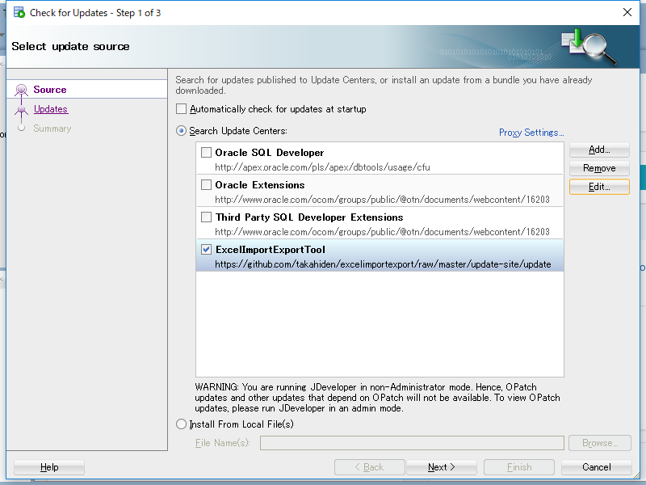
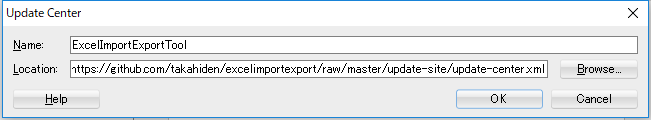
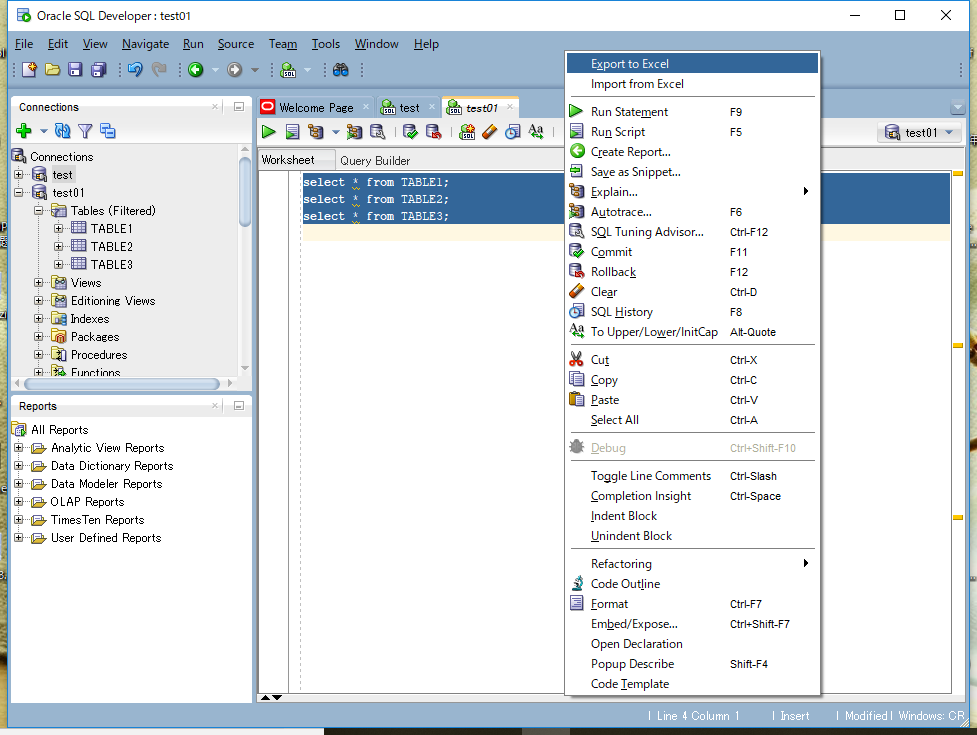
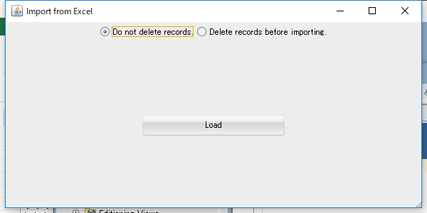

# SQL Developer extention Tool
## Excel ImportExport Tool
A quick context menu action on editor.

This is a plugin to export and import excel files from SQL Developer in a simplified way.  
BLOB automatically generates another dat file.  

I referred to the following URL.  
buildtools has been copied from the following.  
https://github.com/oracle/oracle-db-examples

## Required
Oracle SQL Developer version 18.1 or above  
(http://www.oracle.com/technetwork/developer-tools/sql-developer/)

## How to install
Enter the following URL to Location.
https://github.com/takahiden/excelimportexport/raw/master/update-site/update-center.xml

  

  

## How to use
Click the right button on editor.
  

Fig. export dialog.  
  

Fig. import dialog.  
  

## Use libraries
It uses the following libraries.

* DBUnit 2.5.1
* Apache POI 3.11
* FoundationDB SQL Parser 1.5.0

## When compiling
Pease store the following library to lib directory.

* commons-codec-1.9.jar
* commons-collections-3.2.1.jar
* dbunit-2.5.1.jar
* fdb-sql-parser-1.4.0.jar
* hamcrest-core-1.3.jar
* junit-4.12.jar
* poi-3.11.jar
* poi-ooxml-3.11.jar
* poi-ooxml-schemas-3.11.jar  
* slf4j-api-1.7.12.jar
* stax-api-1.0.1.jar
* xmlbeans-2.6.0.jar
  
Please rewrite SQLDeveloper18.1.userlibraries. And please import to Eclipse.

## Notes
Please note that i do not take any responsibility or liability for any damage or loss caused through this tool.
