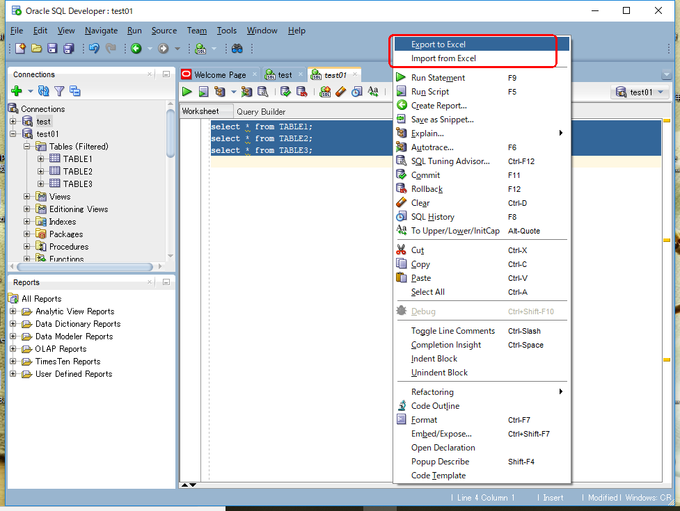
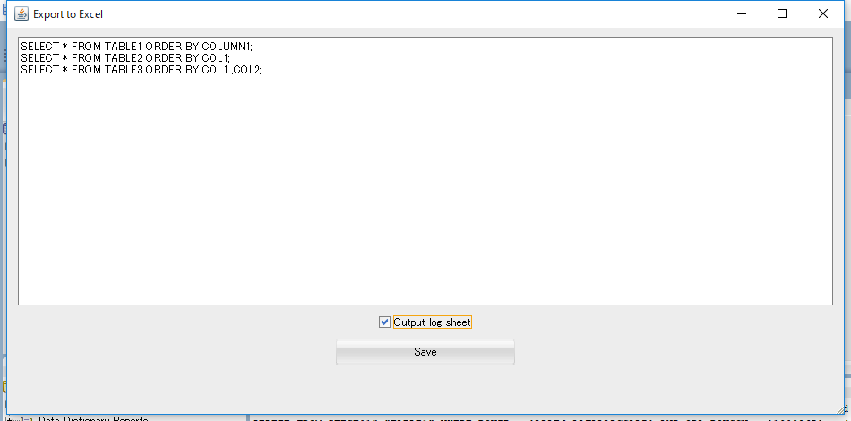

# SQL Developer extention Tool
## Excel ImportExport Tool
A quick context menu action on editor.

This is a plugin to export and import excel files from SQL Developer in a simplified way.  
BLOB automatically generates another dat file.  

I referred to the following URL.  
buildtools has been copied from the following.  
https://github.com/oracle/oracle-db-examples

## Required
Oracle SQL Developer version 18.1 or above  
(http://www.oracle.com/technetwork/developer-tools/sql-developer/)

## How to install
Enter the following URL to Location.
https://github.com/takahiden/excelimportexport/raw/master/update-site/update-center.xml

  

  

## How to use
Click the right button on editor. Or click the right button on tables.
  

  

Fig. export dialog.  
  

Fig. import dialog.  
  

Fig. import excel sample.  
  
  

Sheet name・・・import table name  
Column name・・・import table column name  

Columns of Date type and Timestamp type can be specified in a format such as YYYY-MM-DD. You can also use SYSDATE and SYSTIMESTAMP.  
You can register files you want to store in BLOB by setting an absolute path.
If "(SQL" is attached to the sheet name, execute the SQL statement of the sheet.  

## Use libraries
It uses the following libraries.

* DBUnit 2.6.0
* Apache POI 4.0
* FoundationDB SQL Parser 1.4.0
* excel-streaming-reader 2.1.0

## When compiling
Pease store the following library to lib directory.

* commons-codec-1.10.jar
* commons-collections-3.2.2.jar
* commons-collections4-4.2.jar
* commons-compress-1.18.jar
* curvesapi-1.04.jar
* dbunit-2.6.0.jar
* fdb-sql-parser-1.4.0.jar
* hamcrest-core-1.3.jar
* junit-4.12.jar
* poi-4.0.0.jar
* poi-ooxml-4.0.0.jar
* poi-ooxml-schemas-4.0.0.jar
* postgresql-8.4-701.jdbc3.jar
* slf4j-api-1.7.25.jar
* xmlbeans-3.0.1.jar
* xercesImpl-2.12.0.jar
* xml-apis-1.4.01.jar
* icu4j-4.6.jar
* java-cup-10k.jar
* org.eclipse.wst.xml.xpath2.processor-2.1.100.jar
* xerces2-xsd11-2.11.1.jar
* xlsx-streamer-2.1.0.jar
* xml-resolver-1.2.jar
  
Please rewrite SQLDeveloper18.1.userlibraries. And please import to Eclipse.

## Notes
Please note that i do not take any responsibility or liability for any damage or loss caused through this tool.
